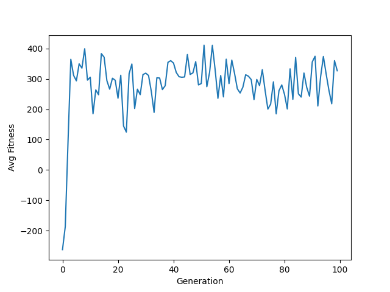
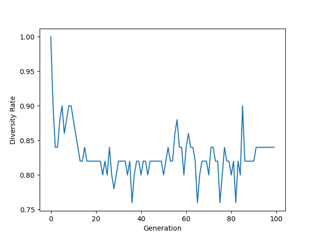

# Knapsack01GA

### Knapsack0/1 problem using Genetic Algorithms

The knapsack problem is a problem in combinatorial optimization: Given a set of items, each with a weight and a
value, determine the number of each item to include in a collection so that the total weight is less than or
equal to a given limit and the total value is as large as possible.

The 0/1 knapsack problem is a special case of the knapsack problem, where each item is either included or not.

**General steps**:
1. Generate the initial population using a binary encoding:
    - Each chromosome is a binary string of length `n` (number of items)
    - Each gene represents an item
    - `1` means the item is included in the knapsack
    - `0` means the item is not included in the knapsack
2. Calculate fitness:
    - The fitness of a chromosome is the total value of the items in the knapsack
    - If the total weight of the items in the knapsack exceeds the maximum weight, the fitness is set to minus
   the total value of the items in the knapsack
3. Select parents:
    - _Roulette wheel selection_: each chromosome is selected with a probability proportional to its fitness
4. Crossover:
   - _Uniform crossover_: each gene is selected based on a binary crossover mask (randomly generated)
   where each bit represents whether the gene is selected from the current (`1`) or the other (`0`) parent
5. Mutation:
    - _Strong mutation_: each gene is mutated based on a mutation mask (randomly generated) where each bit
   represents a probability of mutation for the corresponding gene, i.e. greater than the `mutation_rate` means
   the gene will be flipped (from `0` to `1` or vice versa) and less than the `mutation_rate` means the gene will
   remain unchanged
6. Repeat 2-5 until the number of generations is reached
7. Plot the fitness (the higher, the better) and diversity (the lower, the better) evolution graphs over the generations

| Avg. Fitness Evolution Plot              | Diversity Evolution Plot                     |
|------------------------------------------|----------------------------------------------|
|  |  |

